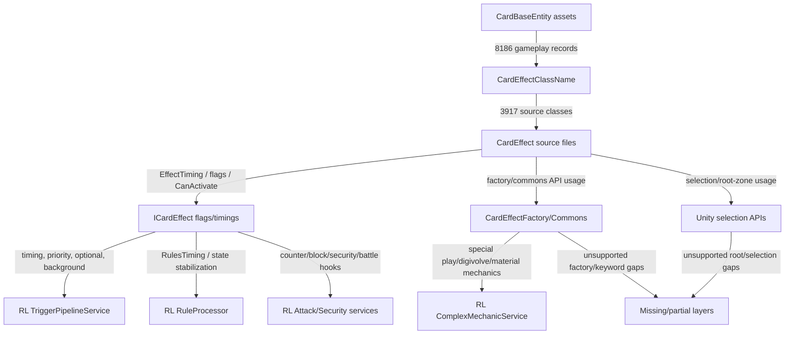

# Mechanic Dependency Graph

- Inventory SHA-256: `f10fff14bd37d401b3e4a48ddd6941d767ebd046ac73f9259795cb7e25ffff97`

## Nodes

| Node | Label |
| --- | --- |
| AttackSecurity | RL Attack/Security services |
| CardBaseEntity | CardBaseEntity assets |
| CardEffectClassName | CardEffectClassName |
| CardEffectSource | CardEffect source files |
| ComplexMechanics | RL ComplexMechanicService |
| FactoryCommons | CardEffectFactory/Commons |
| ICardEffect | ICardEffect flags/timings |
| MissingLayers | Missing/partial layers |
| RuleProcessor | RL RuleProcessor |
| SelectionApis | Unity selection APIs |
| TriggerPipeline | RL TriggerPipelineService |
